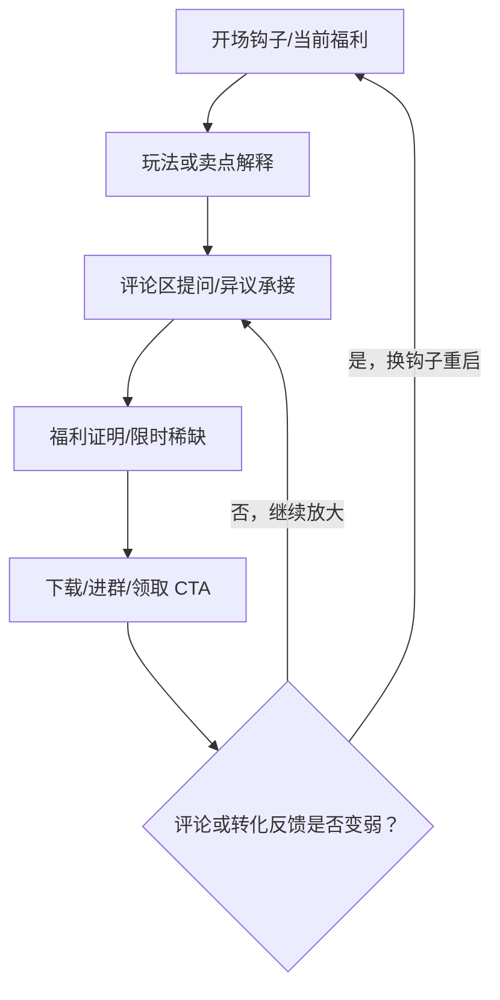

# 分析报告参考模板

## 直播间基本信息

直播截图（录制开始时）

| 字段 | 内容 |
| --- | --- |
| **直播间名称** |  |
| **游戏产品** |  |
| 游戏类型 |  |
| 直播间类型 |  |
| 直播间观看人数 |  |
| **直播链接** |  |
| **录制时长** |  |

补充素材路径：录屏文件、音频文件、转写文本与抽帧素材均存放在 `<归档目录>`。

---

## 直播间一句话结论

用 1-3 句话概括该直播间的核心打法、有效点和主要风险。

## 画面内容分析

### 主播造型和人设

| 维度 | 内容 |
| --- | --- |
| **角色定位** |  |
| **核心标签** |  |
| **直播风格** |  |
| **信任建立方式** |  |
| **情绪/人设支撑点** |  |

### 直播间贴面与 UI

<!-- ui-table-two-columns -->

该部分用两列表格呈现，只保留“模块”和“观察内容”。不要添加“关键截图/证据”列；默认不再添加独立 UI 截图小节，除非用户明确要求。

| 模块 | 观察内容 |
| --- | --- |
| 标题/贴片 |  |
| 商品卡/福利入口 |  |
| 引导语/字幕 |  |
| 倒计时/优惠/挂件 |  |
| 评论区可见信息 |  |
| 强弱点 |  |

## 直播核心内容

### 核心话术提炼

**核心钩子话术**

> 

**引流 CTA 话术**

> 

**付费讲解话术**

> 

**留人/互动话术**

> 

---

### 游戏画面内容

- **展示玩法：**
- **展示节奏：**
- **高光/爽点：**
- **信息理解门槛：**
- **与话术配合度：**

### 脚本循环机制

循环周期：约 `<X>` 分钟/圈

<!-- script-loop-flowchart -->

<!-- script-loop-text-analysis -->

① **阶段一：`<阶段名称>`**  
- **阶段目的：** `<例如：确认官方身份/建立信任/抛出当前福利>`  
- **关键话术：** “`<引用或概括主播在该阶段反复使用的话术>`”  
- **观众反应：** `<评论区问题、停留、下载意向、质疑或沉默>`  
- **转化作用：** `<该阶段如何把观众推进到下一步>`

↓

② **阶段二：`<阶段名称>`**  
- **阶段目的：** `<例如：解释产品价值/降低理解门槛/放大差异点>`  
- **关键话术：** “`<引用或概括主播在该阶段反复使用的话术>`”  
- **观众反应：** `<评论区问题、停留、下载意向、质疑或沉默>`  
- **转化作用：** `<该阶段如何承接上一阶段并推进 CTA>`

↓

③ **阶段三：`<阶段名称>`**  
- **阶段目的：** `<例如：互动挑战/规则确认/异议处理>`  
- **关键话术：** “`<引用或概括主播在该阶段反复使用的话术>`”  
- **观众反应：** `<评论区问题、停留、下载意向、质疑或沉默>`  
- **转化作用：** `<该阶段如何制造参与感或解决阻碍>`

↓

④ **阶段四：`<阶段名称>`**  
- **阶段目的：** `<例如：福利承接/关系承诺/最后下载召回>`  
- **关键话术：** “`<引用或概括主播在该阶段反复使用的话术>`”  
- **观众反应：** `<评论区问题、停留、下载意向、质疑或沉默>`  
- **转化作用：** `<该阶段如何收口，并让循环回到阶段一>`

↓

回到 ①：`<说明主播如何换钩子、换福利或换问题重新启动循环>`

## 互动机制

### 评论区互动

爬取或记录评论区具体内容，优先保留与转化、疑问、异议、产品理解相关的评论；如涉及个人隐私，做匿名化处理。

| 评论/信号 | 类型 | 主播/场控回应 | 分析 |
| --- | --- | --- | --- |
|  | 高频问题/异议/购买意向/情绪反馈/对比提及 |  |  |

### 评论区互动洞察

- 高频问题：
- 购买/下载意向：
- 主要顾虑：
- 情绪倾向：
- 主播或场控是否回应：

### 上福袋频率

- 出现时间：
- 频率：
- 福袋/礼物/互动目的：
- 对停留或转化的影响：

## 对我方的测试建议

1.
2.
3.

## 主播脚本全文

放入语音转文字的全部内容，并给出 AI 整理后的版本。若 FunASR 识别噪声较多，先标注“非逐字稿，已按语义整理”。

### 原始 ASR 全文

> 

### AI 整理版脚本

| 时间 | 话术文本/摘要 | 话术类型 | 备注 |
| --- | --- | --- | --- |
|  |  | 开场/讲解/促单/异议/互动/承接 |  |

## 后续学习沉淀

- 可沉淀到话术库：
- 可沉淀到异议库：
- 可沉淀到视觉策略：
- 可沉淀到分析规则：
- 下次需要重点观察：
